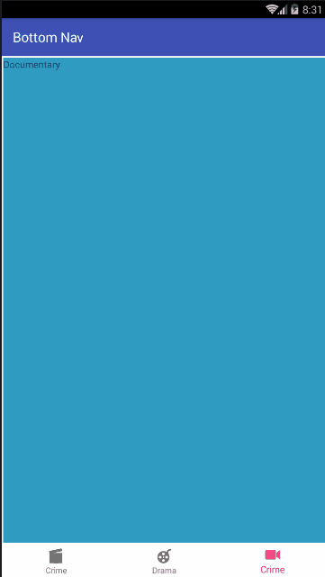

# BottomNav
Android Bottom Navigation With Fragments Example.

Android Bottom Navigation with simple Fragments Example.
We simply switch through various fragments when the bottom navigation tabs are clicked.

Here is the demo:

Check the tutorial here: https://android.camposha.info/android-ahbottomnavigation/
